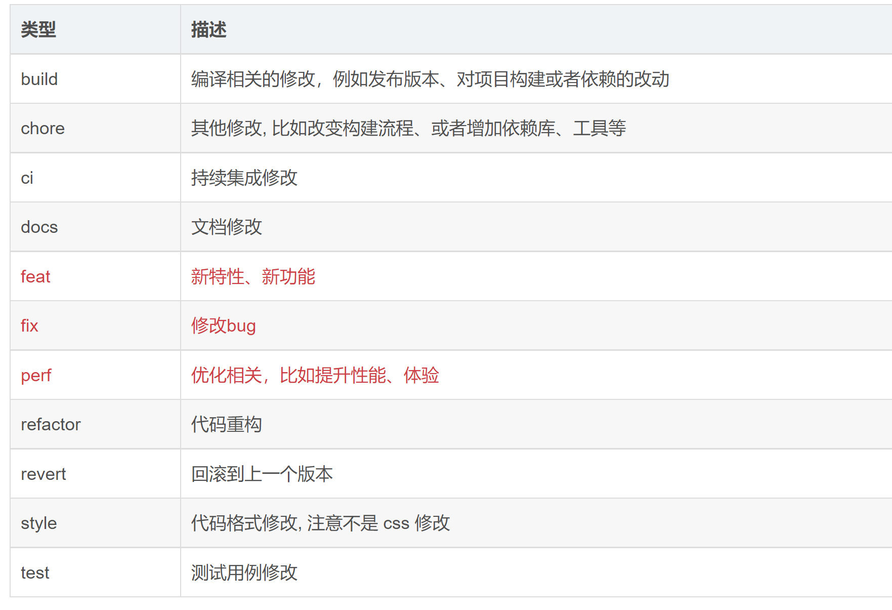

# git提交规范


1. 背景
Git 是目前世界上最先进的分布式版本控制系统，在我们平时的项目开发中已经广泛使用。而当我们使用Git提交代码时，都需要写Commit Message提交说明才能够正常提交。

git commit -m "提交"
1
然而，我们平时在编写提交说明时，通常会直接填写如"fix"或"bug"等不规范的说明，不规范的提交说明很难让人明白这次代码提交究竟是为了什么。而在工作中，一份清晰简介规范的 Commit Message 能让后续代码审查、信息查找、版本回退都更加高效可靠。因此我们需要一些工具来约束开发者编写符合规范的提交说明。

2. 提交规范
那么，什么样的提交说明才能符合规范的说明呢？不同的团队可以制定不同的规范，当然，我们也可以直接使用目前流行的规范，比如[Angular Git Commit

Guidelines。接下来将会对目前流行的Angular提交规范进行介绍。

2.1 提交格式
符合规范的Commit Message的提交格式如下，包含了页眉（header）、正文（body）和页脚（footer）三部分。其中，header是必须的，body和footer可以

忽略。
```js
<type>(<scope>): <subject>
// 空一行
<body>
// 空一行
<footer>
  ```
2.2 页眉设置
页眉（header）通常只有一行，包括了提交类型（type）、作用域（scope）和主题（subject）。其中，type和subject是必须的，scope是可选的。

2.2.1 提交类型

提交类型（type）用于说明此次提交的类型，需要指定为下面其中一个：



2.2.2 作用域

作用域（scope）表示此次提交影响的范围。比如可以取值api，表明只影响了接口。

2.2.3 主题

主题（subject）描述是简短的一句话，简单说明此次提交的内容。

2.3 正文和页脚
正文（body）和页眉（footer）这两部分不是必须的。

如果是破坏性的变更，那就必须在提交的正文或脚注加以展示。一个破坏性变更必须包含大写的文本 BREAKING CHANGE，紧跟冒号和空格。脚注必须只包含 B R E A K I N G C H A N G E 、 外 部 链 接 、 i s s u e 引 用 和 其 它 元 数 据 信 息 BREAKING CHANGE、外部链接、issue 引用和其它元数据信息BREAKINGCHANGE、外部链接、issue引用和其它元数据信息。例如修改了提交的流程，依赖了一些包，可以在正文写上：BREANKING CHANGE：需要重新npm install，使用npm run cm代替git commit。

下面给出了一个Commit Message例子，该例子中包含了header和body。

chore: 引入commitizen

BREANKING CHANGE：需要重新npm install，使用npm run cm代替git commit
1
2
3
当然，在平时的提交中，我们也可以只包含header，比如我们修改了登录页面的某个功能，那么可以这样写 Commit Message。

feat(登录）：添加登录接口
1
3.使用Git命令行提交信息
为了规范commit信息，可以配置一个全局的 commit message template ,所有提交的 commit message

都按照这个配置来写

首先新建模板文件:

在任意目录下新建.getmessage.txt ，填入以下模板

# 类型字段包含:
#     feat：新功能（feature）
#     fix：修复bug
#     doc：文档（documentation）
#     style： 格式化 ESLint调整等（不影响代码运行的变动）
#     refactor：重构（即不是新增功能，也不是修改bug的代码变动）
#     test：增加测试
#     build: 影响构建系统或外部依赖项的更改(maven,gradle,npm 等等)
#     ci: 对CI配置文件和脚本的更改
#     chore：对非 src 和 test 目录的修改
#     revert: Revert a commit
# 影响范围：
#     用于说明 commit 影响的范围，比如修改的登录页、账户中心页等
# 主题：
#    commit目的的简短描述，不超过50个字符
# Body 部分是对本次 commit 的详细描述，可以分成多行
# Footer用来关闭 Issue或以BREAKING CHANGE开头，后面是对变动的描述、
#       以及变动理由和迁移方法

3. Commitizen
虽然有了规范，但是还是无法保证每个人都能够遵守相应的规范，因此就需要使用一些工具来保证大家都能够提交符合规范的Commit Message。常用的工具包括了可视化工具和信息交互工具，其中Commitizen是常用的Commitizen工具，接下来将会先介绍Commitizen的使用方法。

3.1 什么是Commitizen
Commitizen是一个撰写符合上面Commit Message标准的一款工具，可以帮助开发者提交符合规范的Commit Message。

3.2 安装Commitizen
可以使用npm安装Commitizen。其中，cz-conventional-changelog是本地适配器。

npm install commitizen cz-conventional-changelog --save-dev
1
3.3 配置Commitizen
安装好Commitizen之后，就需要配置Commitizen，我们需要在package.json中加入以下代码。其中，需要增加一个script，使得我们可以通过执行npm run cm

来代替git commit，而path为cz-conventional-changelog包相对于项目根目录的路径。

”script": {  "cm: "git-cz"},"config": {
  "commitizen": {
    "path": "./node_modules/cz-conventional-changelog"
  }
}
1
2
3
4
5
配置完成之后，我们就可以通过执行npm run cm来代替git commit，接着只需要安装提示，完成header、body和footer的编写，就能够编写出符合规范的

Commit Message。


4. vscode可视化提交工具
除了使用Commitizen信息交互工具来帮助我们规范Commit Message之外，我们也可以使用编译器自带的可视化提交工具。接下来，将会介绍VSCode可视化提交工具的使用方法。

在VSCode的EXTENSIONS中找到 git-commit-plugin插件，点击install进行安装。


安装完成之后，可以通过git add添加要提交的文件，接着，在Source Control点击show git commit template图标，开始编写Commit Message信息。


接下来只需要按照指引进行Commit Message的编写。


当编写完成之后，可以得到符合规范的Commit Message，这个时候就可以放心将Commit Message及所修改的文件进行提交啦。


5. idea可视化工具
idea 安装此插件：Git Commit Template


参数解析如下:

feat: 新功能
fix: 修复bug
docs: 只有文档改变
style: 并没有影响代码的意义(空格，去掉分号，格式的修改等)
refactor: 代码的修改并没有修改bug，也没有添加新功能
perf: 代码的修改提高的性能
test: 添加测试
build: 影响构建系统或外部依赖项的更改(maven,gradle,npm 等等)
ci: 对CI配置文件和脚本的更改
chore：对非 src 和 test 目录的修改
revert: Revert a commit
影响范围: 用于说明commit影响的范围，比如 修改的登录页，账户中心等

Body 部分是对本次 commit 的详细描述，可以分成多行