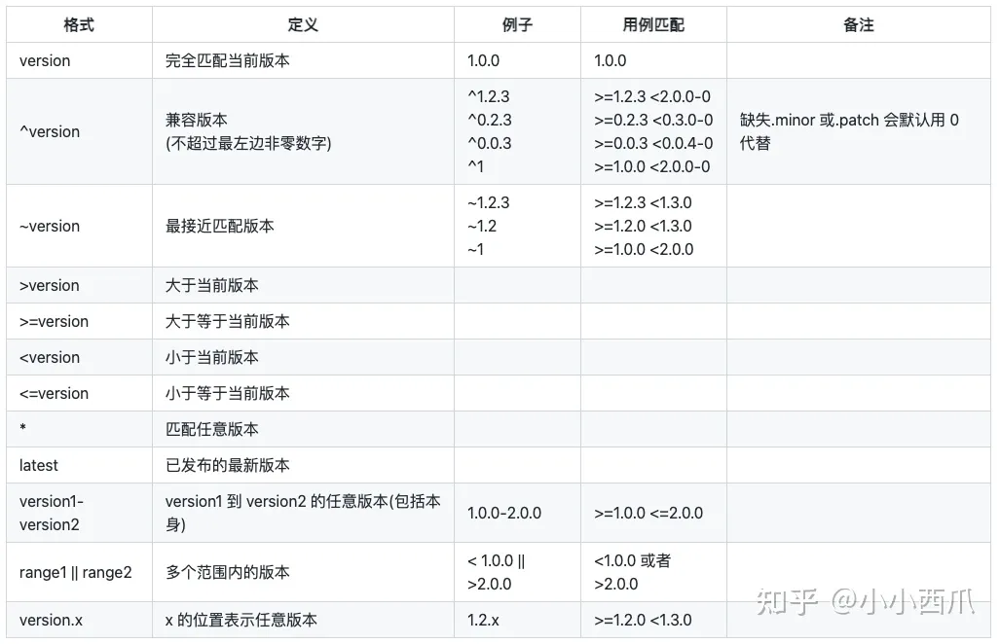

# npm

# 一、查看当前的镜像源

```shell
npm config get registry
或
yarn config get registry
```

# 二、设置为淘宝镜像源（全局设置）

```shell
npm config set registry https://registry.npm.taobao.org
或
yarn config set registry https://registry.npm.taobao.org
```

> 注意：npm 和 yarn 是两个不同的包管理器，如果两个都想用淘宝镜像，则分别都要设置

# 三、切换回默认镜像源（全局设置）

首先要找到默认的镜像源，然后根据第二步进行设置，即可切回默认镜像源

```shell
常用的 默认镜像源
npm ---- https://registry.npmjs.org
yarn --- https://registry.yarnpkg.com
```

如果你不记得 镜像源，可以借助 nrm 这个工具进行查询

1.安装 nrm 工具

```
npm install nrm -g
```

2.查询 镜像源列表
nrm ls
查询成功，如下所示

```
  npm ---- https://registry.npmjs.org
  cnpm --- http://r.cnpmjs.org
  taobao - https://registry.npm.taobao.org
  nj ----- https://registry.nodejitsu.com
  npmMirror  https://skimdb.npmjs.com/registry
  edunpm - http://registry.enpmjs.org
  yarn --- https://registry.yarnpkg.com
```

