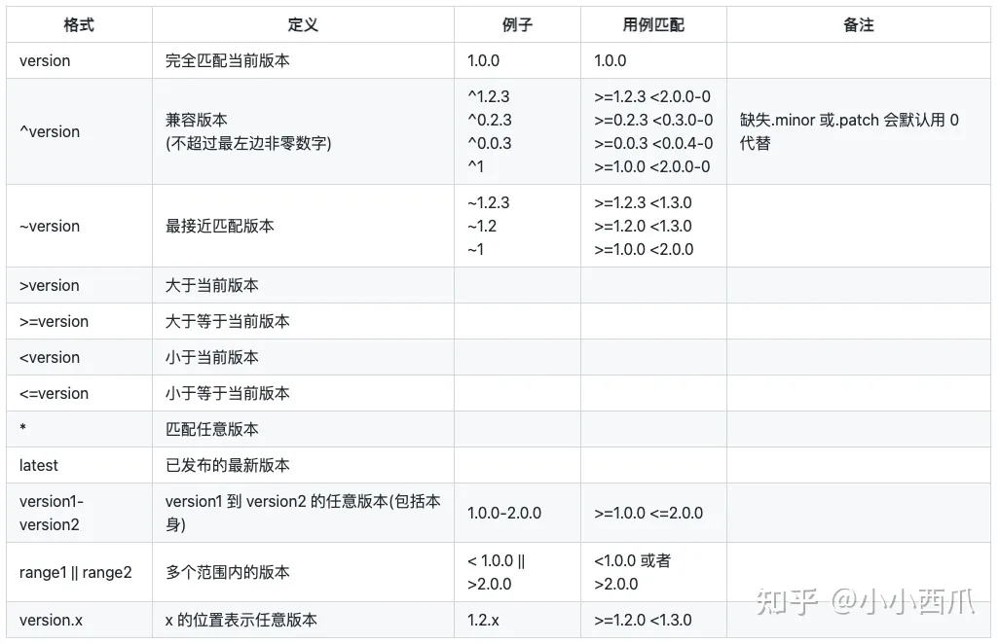

---
nav:
  title: docs
  order: -1
order: -1
title: npm 包管理
---

# npm

## 一、查看当前的镜像源

```shell
npm config get registry
或
yarn config get registry
```

## 二、设置为淘宝镜像源（全局设置）

```shell
npm config set registry http://registry.npmmirror.com
或
yarn config set registry http://registry.npmmirror.com
```

> 注意：npm 和 yarn 是两个不同的包管理器，如果两个都想用淘宝镜像，则分别都要设置

## 三、切换回默认镜像源（全局设置）

首先要找到默认的镜像源，然后根据第二步进行设置，即可切回默认镜像源

```shell
常用的 默认镜像源
npm ---- https://registry.npmjs.org
yarn --- https://registry.yarnpkg.com

npm config set registry https://registry.npmjs.org
或
yarn config set registry https://registry.yarnpkg.com
```

<InstallDependencies 
  npm='npm config set registry https://registry.npmjs.org'
  yarn='yarn config set registry https://registry.yarnpkg.com'
/>
</InstallDependencies>

## 下载指定版本的包,可通过淘宝的镜像文件下载

```sh
npm install jquery@1.7 --registry=https://registry.npm.taobao.org
```

如果你不记得 镜像源，可以借助 nrm 这个工具进行查询

1.安装 nrm 工具

```shell
npm install nrm -g
```

2.查询 镜像源列表 `nrm ls`

查询成功，如下所示

- npm ---- https://registry.npmjs.org
- cnpm --- http://r.cnpmjs.org
- taobao - http://registry.npmmirror.com
- nj ----- https://registry.nodejitsu.com
- npmMirror https://skimdb.npmjs.com/registry
- edunpm - http://registry.enpmjs.org
- yarn --- https://registry.yarnpkg.com



## 别名安装

npm 安装

```shell
## npm 别名安装写法
npm install vue2@npm:vue@^2.6.14
npm install vue3@npm:vue@^3.2.37
```

yarn 安装

```shell
## yarn 别名安装写法
yarn add vue2@yarn:vue@^2.6.14
yarn add vue3@yarn:vue@^3.2.37
```

这里以 npm 为例,安装完成后可以看到 package.json 已经有两个新的包了

```json
{
  "dependencies": {
    "vue2": "npm:vue@^2.6.14",
    "vue3": "npm:vue@^3.2.37"
  }
}
```

也可以选择一个普通安装, 一个起别名安装

## yarn

### 添加依赖项

```bash
yarn add [package]
yarn add [package]@[version]
yarn add [package]@[tag]
```

## 为不同类别的依赖项添加依赖项

```bash
yarn add [package] --dev  # dev dependencies
yarn add [package] --peer # peer dependencies
```

### 升级依赖

```bash
yarn up [package]
yarn up [package]@[version]
yarn up [package]@[tag]
```

### 删除依赖项

```bash
yarn remove [package]
```

### 升级 Yarn 本身

```bash
yarn set version latest
yarn set version from sources
```
